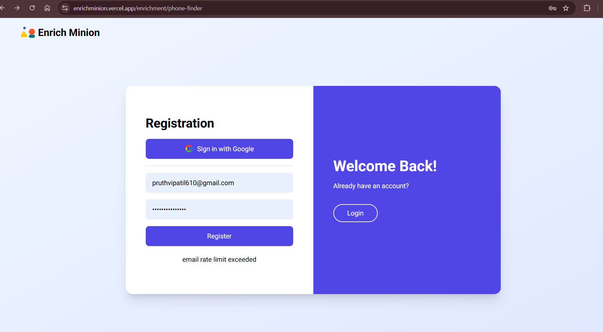
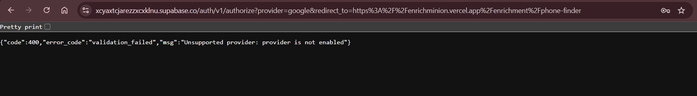

# Bug Report & Root Cause Analysis
Project: EnrichMinion (https://enrichminion.vercel.app)
Prepared by: Pruthviraj Patil (QA Engineer)
Date: November 5, 2025

---

# BUG-001 – First-time signup shows “Email rate limit exceeded”

Severity: Major
Module: Signup

Steps to Reproduce:
1. Navigate to https://enrichminion.vercel.app/enrichment/phone-finder
2. Enter a valid email and password
3. Click on “Create Account”
4. Observe the error message on the screen

Expected Result:
Signup should complete successfully and verification email should be sent to the provided address.

Actual Result:
System displays:
“Email rate limit exceeded”
even on first signup attempt.
No verification email is received.

Evidence:
- Console log: shows 429 response from Supabase API
- Screenshot:  

Root Cause Analysis:
Backend Issue
- The error message originates from the email provider’s rate-limiting endpoint in Supabase or associated email API.
- Likely cause: test environment configuration reused an existing sender identity or exceeded hourly limit on provider.
- Frontend correctly surfaces backend message; however, message copy could be improved for UX clarity.

---

# BUG-002 – Google sign-in returns “Unsupported provider: provider is not enabled”

Severity: Major
Module: Authentication (Google OAuth)

Steps to Reproduce:
1. Navigate to https://enrichminion.vercel.app/enrichment/phone-finder
2. Click “Sign in with Google”
3. Observe API response or UI message

Expected Result:
User should be redirected to Google OAuth login page and then back to EnrichMinion dashboard after authorization.

Actual Result:
A raw JSON error appears on screen:
{"code":400,"error_code":"validation_failed","msg":"Unsupported provider: provider is not enabled"}

Evidence:
- DevTools Network tab shows /auth/v1/token 400 response
- Screenshot:

Root Cause Analysis:
Backend + Frontend (combined)
- Backend: Supabase configuration for OAuth provider “Google” is not enabled.
- Frontend: lacks proper error handling for unsupported providers (renders raw JSON instead of friendly message).
- Fix requires enabling provider in Supabase and implementing better frontend fallback UI.

---

# BUG-003 – Password reset shows success but no email received

Severity: Major
Module: Password Reset

Steps to Reproduce:
1. Go to https://enrichminion.vercel.app/enrichment/phone-finder
2. Enter a registered email address
3. Click “Send Password Reset Link”
4. Observe the system message

Expected Result:
User should receive a password reset email in inbox/spam folder.

Actual Result:
System displays:
“Password reset link sent to your email.”
But no email is received after multiple attempts.

Evidence:
- DevTools: /auth/v1/recover returns 200 OK but no subsequent email received.
- Screenshot:

Root Cause Analysis:
Backend Issue
- The email dispatch function in Supabase is returning success (200) but not triggering the actual email send.
- Likely causes:
  - Disabled email template
  - Misconfigured SMTP provider or sandbox mode
- Frontend behaves correctly (displays success after 200 response).

---

# Summary Table

| Bug ID | Title | Severity | Root Cause | Module | Status |
|--------|--------|-----------|-------------|----------|----------|
| BUG-001 | Email rate limit exceeded on signup | Major | Backend | Signup | Open |
| BUG-002 | Google sign-in provider disabled | Major | Backend + Frontend | Auth | Open |
| BUG-003 | Password reset email not received | Major | Backend | Password Reset | Open |

---

# Overall RCA Summary

| Category | Impact | Description |
|-----------|---------|-------------|
| Frontend | Moderate | Missing graceful handling for API error messages; displays raw JSON for OAuth. |
| Backend | High | Misconfigured Supabase authentication providers and email rate-limiting. |
| Environment | Moderate | Likely sandbox/test email environment causing message delivery failures. |

---

Recommendation:
Before further functional testing, backend configuration for Supabase Auth and email services must be verified. Once authentication and email flow stabilize, proceed with Enrichment and Verification module test execution.
